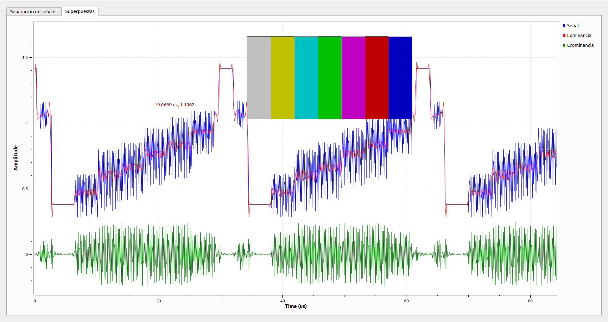

## Parte 2
2) implementar un script de python que codifique un archivo de imagen en una señal de video compuesta.

a) Codificar una señal de barra de colores. Con un script de python o GNURadio e indicar los niveles de luminancia que tiene cada color y comparelos con los que se obtienen  utilizando las expresiones de las señales de diferencia de color. Extraer conclusiones.

> 
> Se puede observar en la imagen que las barras de colores estan atenuadas en luminancia, por lo que es de esperarse en la seál descompuesta, que los valores sean menores a los teóricos.
>
>| Color  | Valor esperado | Valor Obtenido | Diferencia |
>|--------|:--------------:|:--------------:|:----------:|
>|Blanco  |      0         |      0.1000    |    0.1     |
>|Amarillo|     0.1090     |      0.1911    |    0.0820  |
>|Cyan    |	    0.3014     |      0.3253    |    0.0239  |
>|Verde   |     0.4103     |      0.3785    |    0.0318  |
>|Magenta |     0.5898     |      0.4885    |    0.1013  |
>|Rojo    |     0.6987     |      0.5574    |    0.1413  |
>|Azul    |     0.8911     |      0.6602    |    0.2309  |
>
> Se puede observar que la diferencia que hay entre el valor esperado de la señal y el valor que se obtiene varía tambien dependiendo del color que se esté revisando.
>
> Probablemente se deba a arrastres en el método implementado al tomar las mediciones de amplitud de los distintos intervalos.
>

b.  Modular la señal de video generada en el punto a. de acuerdo al estandar NTSC en BLV. Grafique el espectro utilizando GNURadio un Scrip de Python.
		Tp2a.grc

c.   Implemente un demodulador amplitud para detectar unicamente la señal de luninancia de la señal TP2a.dat
		Tp2a.grc